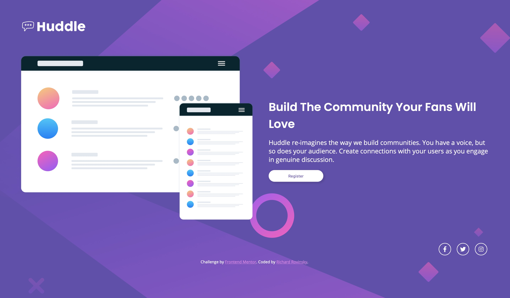

# Frontend Mentor - Huddle landing page with single introductory section solution

This is a solution to the [Huddle landing page with single introductory section challenge on Frontend Mentor](https://www.frontendmentor.io/challenges/huddle-landing-page-with-a-single-introductory-section-B_2Wvxgi0). Frontend Mentor challenges help you improve your coding skills by building realistic projects. 

## Table of contents

- [Overview](#overview)
  - [The challenge](#the-challenge)
  - [Screenshot](#screenshot)
  - [Links](#links)
- [My process](#my-process)
  - [Built with](#built-with)
  - [What I learned](#what-i-learned)
- [Author](#author)

**Note: Delete this note and update the table of contents based on what sections you keep.**

## Overview

### The challenge

Users should be able to:

- View the optimal layout for the page depending on their device's screen size
- See hover states for all interactive elements on the page

### Screenshot



### Links

- Solution URL: [View my code here](https://github.com/rikirovinsky/huddle-landing-page.git)
- Live Site URL: [My solution](https://rikirovinsky.github.io/huddle-landing-page)

## My process

### Built with

- Semantic HTML5 markup
- CSS custom properties for colors
- Flexbox
- CSS Grid
- Mobile-first workflow

### What I learned

I was unaware of some changes to background image, that happen when you change your portrait view to landscape. Accidentally found out when checking my final work in developer mode. Turning between view options.

Easy fix, see below:

```css
@media (orientation: landscape) {
  body {
    background-size: cover;
  }
}
```

## Author

- Website - [Richard Rovinsky](https://github.com/rikirovinsky)
- Frontend Mentor - [@rikirovinsky](https://www.frontendmentor.io/profile/rikirovinsky)
